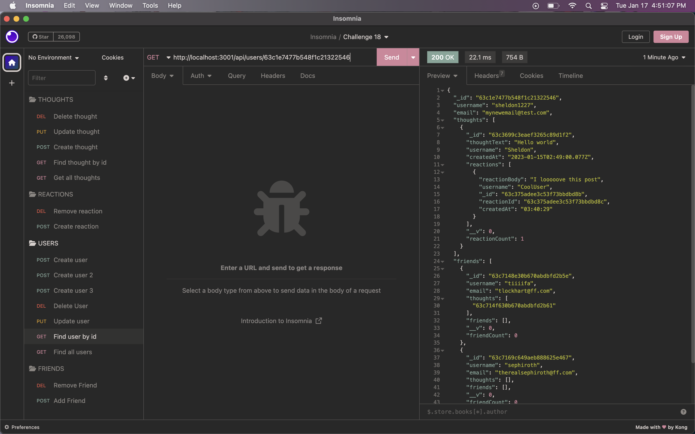

# nosql-social-network-api

## Description

A backend application created with MongoDB to perform basic functionality for a social media site. The ability to add create, read, update, and delete users and posts. Posts can have comments created or deleted. Friends can be added or removed from an array. 

## Installation

To install, git clone the repository to your computer.
 
In your terminal

```
npm install
```

## Usage 

[Walkthrough Video Here!]()

To use this backend, open in your terminal. Start the sever with either

```
nodemon server.js
```

or 

```
node server.js
```



## Credits

MongoDB

Mongoose

Insomnia

## License

This project uses the MIT license

## Features 

* CRUD individual Users
* Add/remove friends from user list
* CRUD posts or "thoughts" for each user
* Add/remove comments or "reactions" to thoughts

